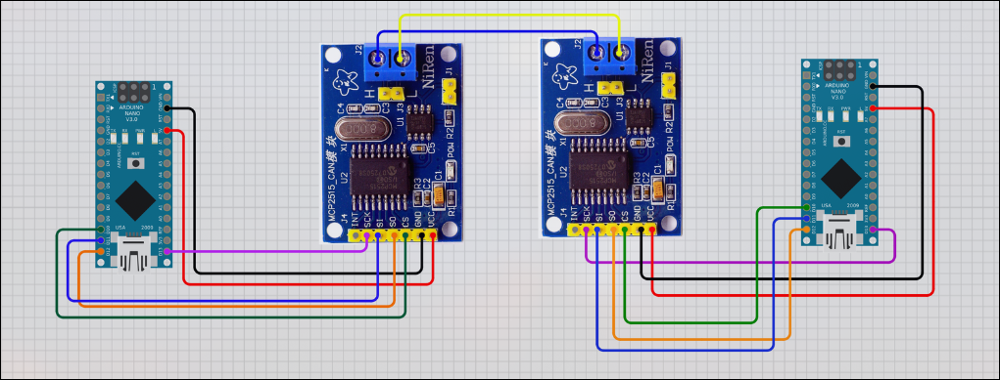
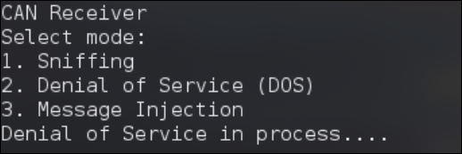
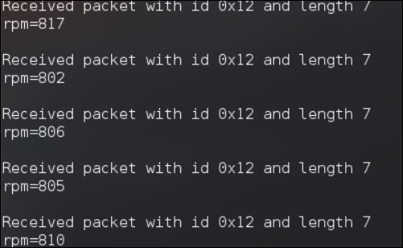
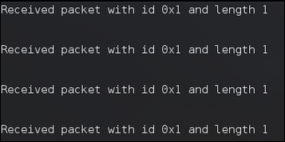
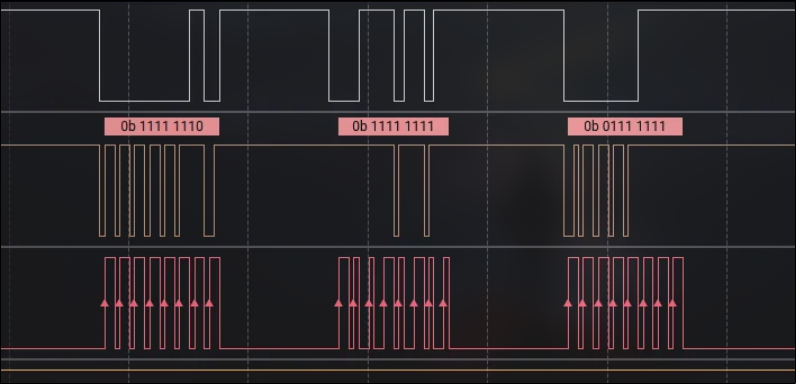

# CAN Bus Communication & Security Toolkit

Arduino Nano + MCP2515 based lab project for demonstrating CAN communication, monitoring, and basic security testing in a controlled environment.

## Overview

This project implements a three-node CAN bus setup that simulates a simple automotive ECU network:

- **ECU A (Sender)** generates RPM-style data from a potentiometer input.
- **ECU B (Receiver)** listens for CAN frames and prints the received payload.
- **Tool Node** can sniff traffic, flood the bus, or inject frames for research and demonstration purposes.

The goal is to provide a practical learning platform for CAN protocol fundamentals, message flow, arbitration behavior, and common attack scenarios in automotive networks.

## System Architecture

All three nodes share the same CAN bus:

- CANH ↔ CANH
- CANL ↔ CANL
- Common ground between all nodes is recommended

### Node Roles

#### ECU A — Sender

- Reads analog input from a potentiometer on A0
- Converts the reading into a text payload in the form `rpm=<value>`
- Transmits the message using CAN ID `0x12`

#### ECU B — Receiver

- Receives CAN frames from the bus
- Prints the CAN ID, frame length, and payload to the Serial Monitor

#### Tool Node

- Provides a simple serial menu for three modes:
	1. Sniffing
	2. Denial of Service
	3. Message Injection

## Hardware Requirements

- Arduino Nano × 3
- MCP2515 CAN module × 3 with TJA1050 transceiver
- Potentiometer × 1
- Jumper wires
- USB cables

## Images

### Wiring / Setup

### Tool Menu

### Sniffing Mode

### Denial of Service Mode

### Signal / Traffic View

## Data Flow

1. Potentiometer position is read by ECU A
2. The analog value is converted into an RPM-style text payload
3. ECU A broadcasts the CAN frame on the bus
4. ECU B receives and prints the payload
5. The tool node can observe or manipulate the traffic depending on the selected mode

## Firmware Files

### sender.ino

ECU A transmitter sketch.

- Initializes CAN at 500 kbps
- Reads the potentiometer value from A0
- Sends payloads using CAN ID `0x12`

### reader.ino

ECU B receiver sketch.

- Initializes CAN at 500 kbps
- Parses incoming CAN frames
- Prints packet metadata and payload to Serial Monitor

### tool.ino

Control and test node sketch.

- Presents a serial menu at startup
- Sniffing mode continuously prints CAN traffic
- DoS mode floods the bus with frames using CAN ID `0x1`
- Injection mode sends a user-defined RPM payload and also transmits a high-priority frame

## Serial Monitor Usage

Open the Serial Monitor at **9600 baud** for all boards.

### Tool Node Menu

Enter one of the following options:

- `1` — Sniffing
- `2` — Denial of Service
- `3` — Message Injection

### Example Output

Sender:

- `CAN Sender`
- `Sending packet ... done`

Receiver:

- `Received packet with id 0x12 and length 7`
- `rpm=805`

Tool Node:

- `Sniffing....`
- `Denial of Service in process....`
- `Injection in process....`

## Getting Started

1. Wire all three MCP2515 modules to the same CAN bus.
2. Connect the potentiometer to ECU A.
3. Upload the sketches:
	 - `sender.ino` to ECU A
	 - `reader.ino` to ECU B
	 - `tool.ino` to the tool node
4. Open Serial Monitor at 9600 baud.
5. Select a mode on the tool node and observe the traffic.

## Project Structure

- `sender.ino` — ECU A transmitter
- `reader.ino` — ECU B receiver
- `tool.ino` — sniffing, DoS, and injection tool
- `circuit.png` — wiring / topology reference
- `menu.png` — tool node menu screenshot
- `sniffer.png` — sniffing output screenshot
- `dos.png` — DoS output screenshot
- `signal.png` — signal / traffic visualization

## Learning Outcomes

- CAN protocol basics
- Multi-node ECU communication
- Arbitration and bus sharing
- Embedded systems integration
- Introductory automotive cybersecurity concepts

## Safety Notice

This repository is intended for educational and research use only.

Do not connect this setup to real vehicles or production automotive systems.

## Future Improvements

- Add CAN ID filtering
- Implement anomaly detection
- Store logs to SD card
- Integrate with SocketCAN on Linux
- Build a simple CAN intrusion detection system

